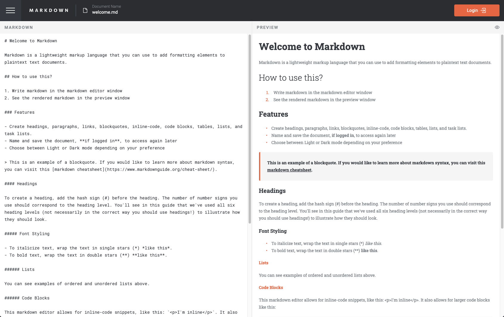

# Frontend Mentor - In-browser markdown editor solution

This is a solution to the [In-browser markdown editor challenge on Frontend Mentor](https://www.frontendmentor.io/challenges/inbrowser-markdown-editor-r16TrrQX9). Frontend Mentor challenges help you improve your coding skills by building realistic projects.

## Table of contents

-   [Overview](#overview)
    -   [The challenge](#the-challenge)
    -   [Screenshots](#screenshots)
    -   [Links](#links)
-   [My process](#my-process)
    -   [Built with](#built-with)
    -   [What I learned](#what-i-learned)
    -   [Continued development](#continued-development)
    -   [Useful resources](#useful-resources)
-   [Author](#author)

## Overview

I am continuing to work on projects to showcase on my [portfolio](https://www.chrisnowicki.io). As usual, [Front End Mentor](https://frontendmentor.io) came through with this awesome _In-Browser Markdown Editor Project_. This is the first project for front end mentor that I made as a full-stack app.

### The challenge

Users should be able to:

-   Create, Read, Update, and Delete markdown documents
-   Name and save documents to be accessed as needed
-   Edit the markdown of a document and see the formatted preview of the content
-   View a full-page preview of the formatted content
-   View the optimal layout for the app depending on their device's screen size
-   See hover states for all interactive elements on the page
-   **Bonus**: If you're building a purely front-end project, use localStorage to save the current state in the browser that persists when the browser is refreshed
-   **Bonus**: Build this project as a full-stack application

### Screenshots




### Links

-   Solution URL: [Add solution URL here](https://your-solution-url.com)
-   Live Site URL: [Add live site URL here](https://your-live-site-url.com)

## My process

I took a similar approach from the [Pomodoro App](https://github.com/chris-nowicki/pomodoro-app) that I recently created.

1. Create the markdown edit/preview functionality.
2. Create the remaining functionality with styling.
3. Add in authorization and connection to MongoDB.

### Built with

-   [NEXT.js](https://nextjs.org/)
-   [React Markdown](https://github.com/remarkjs/react-markdown)
-   [remark-gfm](https://github.com/remarkjs/remark-gfm)
-   [auth0](https://auth0.com/)
-   [MongoDB](https://www.mongodb.com/)
-   [TypeScript](https://www.typescriptlang.org/)
-   [Sass](https://sass-lang.com/)
-   Deployed on [Vercel](https://www.vercel.com)

### What I learned

For this project I really wanted to focus on authorization using other than _user name_ and _password_. I chose the auth0 library because they had a very nice [SDK](https://auth0.com/docs/quickstart/webapp/nextjs/01-login) developed for NEXT.js and configured it to authorize using Google and GitHub.

This made implementing the authentication routes fairly simple by adding an _/auth_ directory and then a _[...auth0].js_ file with the following code which provides the _api/auth/login_, _api/auth/logout_, and _api/auth/callback_ routes required by auth0:

```javascript
import { handleAuth } from '@auth0/nextjs-auth0'

export default handleAuth()
```

Once I got the routes setup it was a bit challenging, at first, to configure auth0 with the appropriate links to operate in the development environment _localhost:3000_. Other than that the SDK provided everything I needed to access the logged in users information.

### Continued development

I'd like to continue to play around with NEXT.js. It's a great React Library to play with that doesn't require you to install a separate server.

### Useful resources

-   [Auth0 NEXT.js SDK](https://auth0.com/docs/quickstart/webapp/nextjs/01-log)

## Author

-   Website - [https://www.chrisnowicki.io](https://www.chrisnowicki.io)
-   Frontend Mentor - [@chris-nowicki](https://www.frontendmentor.io/profile/chris-nowicki)
-   Twitter - [@iamwix](https://www.twitter.com/iamwix)
